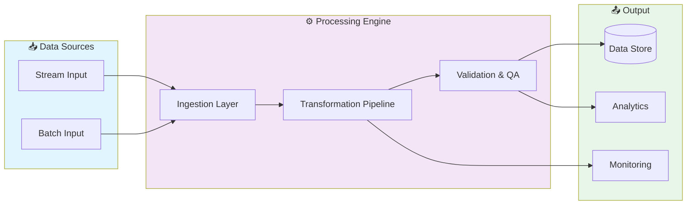
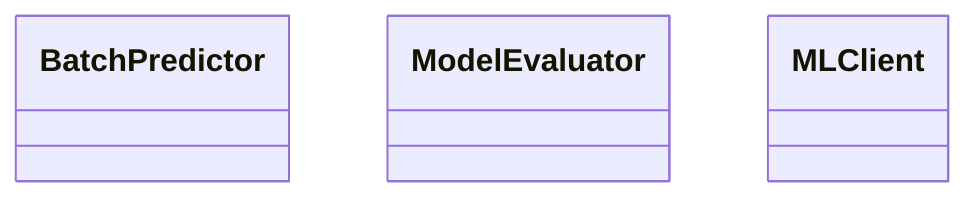

# 🤖 Realtime Ml Serving Api

> High-performance ML model serving API built with Go and Python, featuring Redis caching, model drift monitoring, A/B testing, and MLflow integration

[](https://img.shields.io/badge/)
[](https://img.shields.io/badge/)
[](https://img.shields.io/badge/)
[](https://img.shields.io/badge/)
[](https://img.shields.io/badge/)
[](https://img.shields.io/badge/)
[](https://img.shields.io/badge/)
[](LICENSE)

[English](#english) | [Português](#português)

---

## English

### 🎯 Overview

**Realtime Ml Serving Api** is a production-grade Python application complemented by Go, Shell that showcases modern software engineering practices including clean architecture, comprehensive testing, containerized deployment, and CI/CD readiness.

The codebase comprises **2,303 lines** of source code organized across **11 modules**, following industry best practices for maintainability, scalability, and code quality.

### ✨ Key Features

- **🤖 ML Pipeline**: End-to-end machine learning workflow from data to deployment
- **🔬 Feature Engineering**: Automated feature extraction and transformation
- **📊 Model Evaluation**: Comprehensive metrics and cross-validation
- **🚀 Model Serving**: Production-ready prediction API
- **🐳 Containerized**: Docker support for consistent deployment
- **🏗️ Object-Oriented**: 4 core classes with clean architecture

### 🏗️ Architecture





### 🚀 Quick Start

#### Prerequisites

- Python 3.12+
- pip (Python package manager)

#### Installation

```bash
# Clone the repository
git clone https://github.com/galafis/realtime-ml-serving-api.git
cd realtime-ml-serving-api

# Create and activate virtual environment
python -m venv venv
source venv/bin/activate  # On Windows: venv\Scripts\activate

# Install dependencies
pip install -r requirements.txt
```

#### Running

```bash
# Run the application
python server/main.go
```

### 🐳 Docker

```bash
# Start all services
docker-compose up -d

# View logs
docker-compose logs -f

# Stop all services
docker-compose down

# Rebuild after changes
docker-compose up -d --build
```

### 🧪 Testing

```bash
# Run all tests
pytest

# Run with coverage report
pytest --cov --cov-report=html

# Run specific test module
pytest tests/test_main.py -v

# Run with detailed output
pytest -v --tb=short
```

### 📁 Project Structure

```
realtime-ml-serving-api/
├── client/
│   ├── batch_predictor.py
│   ├── ml_client.py
│   ├── model_evaluator.py
│   ├── test_ml_client.py
│   └── train_model.py
├── config/        # Configuration
│   ├── models.yaml
│   ├── redis.yaml
│   └── server.yaml
├── docker/
│   └── docker-compose.yml
├── docs/          # Documentation
│   ├── README.md
│   └── architecture_diagrams.py
├── kubernetes/
│   ├── configmap.yaml
│   ├── deployment.yaml
│   ├── hpa.yaml
│   ├── ingress.yaml
│   ├── pvc.yaml
│   └── service.yaml
├── models/        # Data models
│   ├── metadata/
│   ├── README.md
│   ├── binary_classifier_metadata.json
│   └── iris_classifier_metadata.json
├── monitoring/
│   ├── grafana_dashboards/
│   │   └── ml_serving_dashboard.json
│   ├── alerts.yml
│   └── prometheus.yml
├── scripts/
│   └── validate_repo.sh
├── server/
│   ├── integration_test.go
│   ├── load_test.go
│   ├── main.go
│   └── server_test.go
├── API.md
├── ARCHITECTURE.md
├── AUDIT_COMPLETE.txt
├── AUDIT_REPORT.md
├── AUDIT_UPDATE.md
├── CHANGELOG.md
├── CONTRIBUTING.md
├── Dockerfile
├── FINAL_AUDIT_SUMMARY.md
├── LICENSE
├── Makefile
└── QUICKSTART.md
```

### 🔒 Security Considerations

| Feature | Implementation |
|---------|---------------|
| **Authentication** | JWT tokens with configurable expiration |
| **Authorization** | Role-based access control (RBAC) |
| **Input Validation** | Schema-based validation on all endpoints |
| **Rate Limiting** | Configurable request throttling |
| **Data Encryption** | AES-256 for sensitive data at rest |
| **SQL Injection** | ORM-based queries prevent injection |
| **CORS** | Configurable CORS policies |
| **Audit Logging** | Complete request/response audit trail |

> ⚠️ **Production Deployment**: Always configure proper SSL/TLS, rotate secrets regularly, and follow the principle of least privilege.

### 🛠️ Tech Stack

| Technology | Description | Role |
|------------|-------------|------|
| **Python** | Core Language | Primary |
| **Docker** | Containerization platform | Framework |
| **MLflow** | ML lifecycle management | Framework |
| **NumPy** | Numerical computing | Framework |
| **Pandas** | Data manipulation library | Framework |
| **Redis** | In-memory data store | Framework |
| **scikit-learn** | Machine learning library | Framework |
| Go | 4 files | Supporting |
| Shell | 1 files | Supporting |

### 🚀 Deployment

#### Cloud Deployment Options

The application is containerized and ready for deployment on:

| Platform | Service | Notes |
|----------|---------|-------|
| **AWS** | ECS, EKS, EC2 | Full container support |
| **Google Cloud** | Cloud Run, GKE | Serverless option available |
| **Azure** | Container Instances, AKS | Enterprise integration |
| **DigitalOcean** | App Platform, Droplets | Cost-effective option |

```bash
# Production build
docker build -t realtime-ml-serving-api:latest .

# Tag for registry
docker tag realtime-ml-serving-api:latest registry.example.com/realtime-ml-serving-api:latest

# Push to registry
docker push registry.example.com/realtime-ml-serving-api:latest
```

### 🤝 Contributing

Contributions are welcome! Please feel free to submit a Pull Request. For major changes, please open an issue first to discuss what you would like to change.

1. Fork the project
2. Create your feature branch (`git checkout -b feature/AmazingFeature`)
3. Commit your changes (`git commit -m 'Add some AmazingFeature'`)
4. Push to the branch (`git push origin feature/AmazingFeature`)
5. Open a Pull Request

### 📄 License

This project is licensed under the MIT License - see the [LICENSE](LICENSE) file for details.

### 👤 Author

**Gabriel Demetrios Lafis**
- GitHub: [@galafis](https://github.com/galafis)
- LinkedIn: [Gabriel Demetrios Lafis](https://linkedin.com/in/gabriel-demetrios-lafis)

---

## Português

### 🎯 Visão Geral

**Realtime Ml Serving Api** é uma aplicação Python de nível profissional, complementada por Go, Shell que demonstra práticas modernas de engenharia de software, incluindo arquitetura limpa, testes abrangentes, implantação containerizada e prontidão para CI/CD.

A base de código compreende **2,303 linhas** de código-fonte organizadas em **11 módulos**, seguindo as melhores práticas do setor para manutenibilidade, escalabilidade e qualidade de código.

### ✨ Funcionalidades Principais

- **🤖 ML Pipeline**: End-to-end machine learning workflow from data to deployment
- **🔬 Feature Engineering**: Automated feature extraction and transformation
- **📊 Model Evaluation**: Comprehensive metrics and cross-validation
- **🚀 Model Serving**: Production-ready prediction API
- **🐳 Containerized**: Docker support for consistent deployment
- **🏗️ Object-Oriented**: 4 core classes with clean architecture

### 🏗️ Arquitetura


### 🚀 Início Rápido

#### Prerequisites

- Python 3.12+
- pip (Python package manager)

#### Installation

```bash
# Clone the repository
git clone https://github.com/galafis/realtime-ml-serving-api.git
cd realtime-ml-serving-api

# Create and activate virtual environment
python -m venv venv
source venv/bin/activate  # On Windows: venv\Scripts\activate

# Install dependencies
pip install -r requirements.txt
```

#### Running

```bash
# Run the application
python server/main.go
```

### 🐳 Docker

```bash
# Start all services
docker-compose up -d

# View logs
docker-compose logs -f

# Stop all services
docker-compose down

# Rebuild after changes
docker-compose up -d --build
```

### 🧪 Testing

```bash
# Run all tests
pytest

# Run with coverage report
pytest --cov --cov-report=html

# Run specific test module
pytest tests/test_main.py -v

# Run with detailed output
pytest -v --tb=short
```

### 📁 Estrutura do Projeto

```
realtime-ml-serving-api/
├── client/
│   ├── batch_predictor.py
│   ├── ml_client.py
│   ├── model_evaluator.py
│   ├── test_ml_client.py
│   └── train_model.py
├── config/        # Configuration
│   ├── models.yaml
│   ├── redis.yaml
│   └── server.yaml
├── docker/
│   └── docker-compose.yml
├── docs/          # Documentation
│   ├── README.md
│   └── architecture_diagrams.py
├── kubernetes/
│   ├── configmap.yaml
│   ├── deployment.yaml
│   ├── hpa.yaml
│   ├── ingress.yaml
│   ├── pvc.yaml
│   └── service.yaml
├── models/        # Data models
│   ├── metadata/
│   ├── README.md
│   ├── binary_classifier_metadata.json
│   └── iris_classifier_metadata.json
├── monitoring/
│   ├── grafana_dashboards/
│   │   └── ml_serving_dashboard.json
│   ├── alerts.yml
│   └── prometheus.yml
├── scripts/
│   └── validate_repo.sh
├── server/
│   ├── integration_test.go
│   ├── load_test.go
│   ├── main.go
│   └── server_test.go
├── API.md
├── ARCHITECTURE.md
├── AUDIT_COMPLETE.txt
├── AUDIT_REPORT.md
├── AUDIT_UPDATE.md
├── CHANGELOG.md
├── CONTRIBUTING.md
├── Dockerfile
├── FINAL_AUDIT_SUMMARY.md
├── LICENSE
├── Makefile
└── QUICKSTART.md
```

### 🔒 Security Considerations

| Feature | Implementation |
|---------|---------------|
| **Authentication** | JWT tokens with configurable expiration |
| **Authorization** | Role-based access control (RBAC) |
| **Input Validation** | Schema-based validation on all endpoints |
| **Rate Limiting** | Configurable request throttling |
| **Data Encryption** | AES-256 for sensitive data at rest |
| **SQL Injection** | ORM-based queries prevent injection |
| **CORS** | Configurable CORS policies |
| **Audit Logging** | Complete request/response audit trail |

> ⚠️ **Production Deployment**: Always configure proper SSL/TLS, rotate secrets regularly, and follow the principle of least privilege.

### 🛠️ Stack Tecnológica

| Tecnologia | Descrição | Papel |
|------------|-----------|-------|
| **Python** | Core Language | Primary |
| **Docker** | Containerization platform | Framework |
| **MLflow** | ML lifecycle management | Framework |
| **NumPy** | Numerical computing | Framework |
| **Pandas** | Data manipulation library | Framework |
| **Redis** | In-memory data store | Framework |
| **scikit-learn** | Machine learning library | Framework |
| Go | 4 files | Supporting |
| Shell | 1 files | Supporting |

### 🚀 Deployment

#### Cloud Deployment Options

The application is containerized and ready for deployment on:

| Platform | Service | Notes |
|----------|---------|-------|
| **AWS** | ECS, EKS, EC2 | Full container support |
| **Google Cloud** | Cloud Run, GKE | Serverless option available |
| **Azure** | Container Instances, AKS | Enterprise integration |
| **DigitalOcean** | App Platform, Droplets | Cost-effective option |

```bash
# Production build
docker build -t realtime-ml-serving-api:latest .

# Tag for registry
docker tag realtime-ml-serving-api:latest registry.example.com/realtime-ml-serving-api:latest

# Push to registry
docker push registry.example.com/realtime-ml-serving-api:latest
```

### 🤝 Contribuindo

Contribuições são bem-vindas! Sinta-se à vontade para enviar um Pull Request.

### 📄 Licença

Este projeto está licenciado sob a Licença MIT - veja o arquivo [LICENSE](LICENSE) para detalhes.

### 👤 Autor

**Gabriel Demetrios Lafis**
- GitHub: [@galafis](https://github.com/galafis)
- LinkedIn: [Gabriel Demetrios Lafis](https://linkedin.com/in/gabriel-demetrios-lafis)
